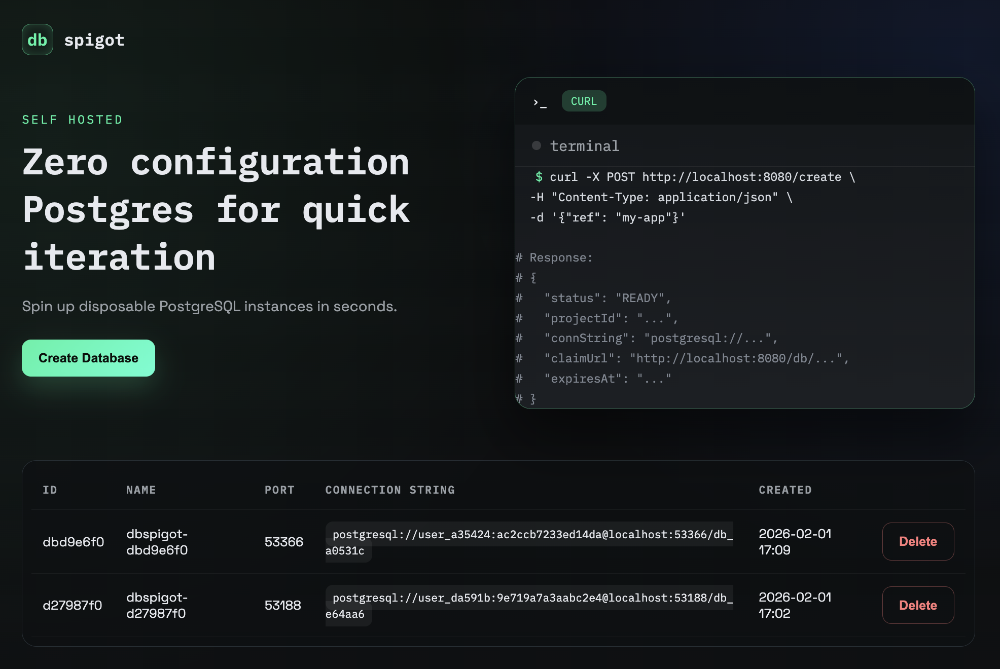

# dbspigot

A while back I was introducted to Instagres, which is a part of Neon's offerings. You simply go to the site and grab a Postgres connection string. If you don't use it or claim it, it ceases to exist. While this is very cool offering for quick development work, I wanted something a little more self hostable.

Enter DBSpigot



DBSpigot is a Go-based web application that serves up connection strings. Behind the scenes it leverages the Docker SDK to spin up an new Postgres container and returns the connection string. You must have Docker Engine 1.24 or newer. You can run `docker version` to view the version.

## Security

The application runs on a server and has access to create and delete containers. Be careful not to expose this to any network you do not trust. The application has the option to enable local auth if (see details below).

## Features

- Small codebase
- Web server templated views using TEMPL
- Docker and Docker Compose support

## Project Structure

```
cmd/
  server/         # Main server entrypoint
    main.go
internal/
  docker/         # Docker integration
    docker.go
  web/            # Web handlers and views
    handlers.go
    views/
      base_templ.go
      base.templ
      index_templ.go
      index.templ
Dockerfile         # Container build file
docker-compose.yml # Multi-container orchestration
go.mod             # Go module definition
```

## Getting Started

### Prerequisites

- Go 1.20+
- Docker & Docker Compose

### Running Locally

1. **Clone the repository:**

   ```sh
   git clone https://github.com/yourusername/dbspigot.git
   cd dbspigot
   ```

2. **Run with Go:**

   ```sh
   DBSPIGOT_USER=admin DBSPIGOT_PASS=secret go run ./cmd/server
   ```

3. **Or run with Docker Compose:**

   ```sh
   docker-compose up --build
   ```

## Development

- Main application code is in `cmd/server/main.go`.
- Web handlers and templates are in `internal/web/`.
- Docker-related code is in `internal/docker/`.

## Configuration

Environment variables:

- `DBSPIGOT_USER`: Basic auth username (required unless `DBSPIGOT_LOCAL_AUTH=true`).
- `DBSPIGOT_PASS`: Basic auth password (required unless `DBSPIGOT_LOCAL_AUTH=true`).
- `DBSPIGOT_HOST`: Hostname used in connection strings (default `localhost`).
- `DBSPIGOT_PORT`: HTTP port for the web server (default `8181`).
- `DBSPIGOT_LOCAL_AUTH`: Set to `true` to disable basic auth (local/dev only).

## License

MIT
